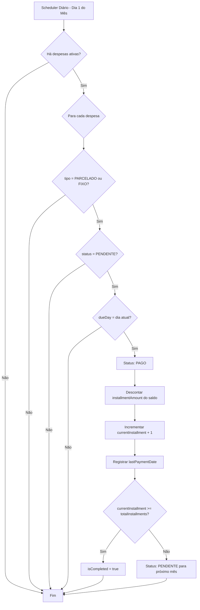

# Análise da Estrutura de Parcelas na Tabela Expenses

## Contexto

Após remover a tabela `Pagamentos`, você propõe gerenciar as parcelas diretamente na tabela `Expenses` com a seguinte lógica para **despesas parceladas** e **despesas fixas**:

- Identificar o dia do pagamento via campo `dueDay`
- Quando chegar o dia, marcar como **PAGO** e **incrementar parcela_atual + 1**
- No mês seguinte, voltar para **PENDENTE**

## Análise da Estrutura Proposta

### ✅ Prós

1. **Simplificação**: Elimina a necessidade de uma tabela separada de pagamentos
2. **Campos já existem**: O modelo `Expenses` já possui os campos necessários:
   - `dueDay` - dia de vencimento
   - `currentInstallment` - parcela atual
   - `totalInstallments` - total de parcelas
   - `installmentAmount` - valor da parcela
   - `status` - PENDENTE/PAGO

3. **Menor complexidade de queries**: Não precisa fazer JOIN entre tabelas

4. **Controle centralizado**: Tudo em um único registro

### ⚠️ Pontos de Atenção

1. **Histórico de pagamentos**: Com um único registro, você perde o histórico granular de quando cada parcela foi paga (data específica do pagamento)

2. **Transição de status automática**: Requer um job/scheduler que rode diariamente para:
   - Verificar se é dia de vencimento
   - Mudar status PENDENTE → PAGO
   - Descontar do saldo

3. **Valor total vs valor parcela**: O campo `amount` guarda o valor total, mas o campo `installmentAmount` guarda o valor da parcela. Na hora de descontar do saldo, qual usar?

4. **Controle de parcelas concluídas**: Como saber quando todas as parcelas foram pagas? Precisará de lógica para:
   - Incrementar `currentInstallment`
   - Marcar como "CONCLUÍDO" ou desativar quando `currentInstallment == totalInstallments`

---

## Tipos de Despesas Afetadas

### 1. Despesas Parceladas (`PARCELADO`)

- Mesmo fluxo: PENDENTE → PAGO → PENDENTE
- Incrementa `currentInstallment` a cada pagamento

### 2. Despesas Fixas (`FIXO`)

- **Mesma lógica**! PENDENTE → PAGO → PENDENTE
- Incrementa `currentInstallment` a cada pagamento (pode representar meses consecutivos)
- Quando `currentInstallment >= totalInstallments`, marca como concluído

### 3. Despesas Avulsas (único pagamento)

- Status inicial: PAGO
- Não entra no fluxo de scheduler (já foi pago)

---

## Questões a Definir

1. **Qual valor descontar do saldo?** `amount` (total) ou `installmentAmount` (parcela)?
   **R:** `installmentAmount` (valor da parcela)

2. **Como identificar o "mês seguinte"?**
   - Todo dia 1 do mês?
   - Após 30 dias do último pagamento?
   - Quando a data atual > registeredAt + (currentInstallment \* 30 dias)?
     **R:** Todo dia 1 do mês

3. **O que acontece quando a parcela é paga manualmente antes do vencimento?**
   **R:** Criar uma coluna para armazenar a data que foi paga

4. **Precisa manter histórico de cada pagamento (data, valor) para relatórios?**
   **R:** O histórico será apenas o tracking do currentInstallment + lastPaymentDate

---

## Alterações Necessárias no Modelo

Com base nas respostas, será necessário adicionar estes campos ao modelo `Expenses`:

1. **`lastPaymentDate`** - `LocalDate` - para controlar quando foi o último pagamento
2. **`isCompleted`** - `Boolean` - para identificar quando todas as parcelas foram pagas

---

## Recomendação

A estrutura é válida e simplifica o banco de dados. Recomendo adicionar:

1. Campo `lastPaymentDate` - para controlar quando foi o último pagamento
2. Campo `isCompleted` - para identificar quando todas as parcelas foram pagas
3. Um scheduler/job para processar as mudanças de status automaticamente

---

## Próximos Passos

1. Adicionar campos `lastPaymentDate` e `isCompleted` na entidade `Expenses`
2. Criar um serviço scheduler para processar as mudanças de status
3. Atualizar o `ExpensesService` para lidar com a lógica de parcelas

Posso detalhar mais algum ponto específico ou criar o código para implementar essa lógica?
