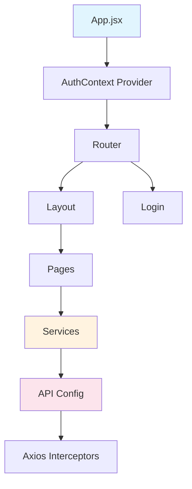

# Análise Completa do Frontend React - Gestão Pessoal

**Data da Análise:** 2026-02-17  
**Analista:** Kilo Code (Architect Mode)  
**Escopo:** Frontend React em `gestao-pessoal/src/`

---

## 1. Estrutura Geral do Projeto

### 1.1 Arquitetura de Pastas

```
gestao-pessoal/src/
├── components/
│   ├── layout/
│   │   ├── Header.jsx
│   │   ├── Layout.jsx
│   │   └── Sidebar.jsx
│   └── ui/
│       ├── Button.jsx
│       ├── Card.jsx
│       ├── Input.jsx
│       └── Modal.jsx
├── config/
│   └── api.js
├── pages/
│   ├── Dashboard.jsx
│   ├── ExpensesList.jsx
│   ├── ExpenseForm.jsx
│   ├── Categories.jsx
│   ├── Installments.jsx
│   └── Login.jsx
├── services/
│   ├── userService.js
│   ├── expenseService.js
│   ├── categoryService.js
│   └── installmentService.js
├── App.jsx
├── main.jsx
└── index.css
```

### 1.2 Fluxo de Dados



---

## 2. Análise por Componente

### 2.1 Configuração da API ([`api.js`](gestao-pessoal/src/config/api.js))

**Pontos Positivos:**

- Uso correto de interceptors para autenticação
- Tratamento de erro 401 para redirecionamento ao login
- Configuração de headers padrão

**Pontos de Atenção:**

- `JSON.parse(localStorage.getItem("user") || "{}")` pode falhar se o JSON for inválido
- Não há tratamento para erros de rede (offline)
- Não há retry logic para requisições falhadas

### 2.2 Serviços ([`services/`](gestao-pessoal/src/services/))

**Estrutura Identificada:**

- `userService`: login, register, getCurrentUser, updateProfile
- `expenseService`: CRUD completo + getByMonth + getSummary
- `categoryService`: CRUD completo
- `installmentService`: getAll, getByExpense, getPending, getByMonth, pay, getSummary

**Status:** Os serviços estão prontos para uso, mas as páginas estão usando dados mockados temporariamente para desenvolvimento.

### 2.2.1 Dados Mockados - PROBLEMA CRÍTICO

**Arquivos que precisam ser modificados para usar API real:**

| Arquivo                                                               | Linha | Ação Necessária                                                         |
| --------------------------------------------------------------------- | ----- | ----------------------------------------------------------------------- |
| [`Dashboard.jsx`](gestao-pessoal/src/pages/Dashboard.jsx:19-36)       | 19-36 | Substituir `setSummary` simulado por `expenseService.getSummary()`      |
| [`ExpensesList.jsx`](gestao-pessoal/src/pages/ExpensesList.jsx:17-69) | 17-69 | Substituir `setExpenses` simulado por `expenseService.getAll()`         |
| [`ExpenseForm.jsx`](gestao-pessoal/src/pages/ExpenseForm.jsx:35-53)   | 35-53 | Substituir `reset` simulado por `expenseService.getById(id)`            |
| [`Categories.jsx`](gestao-pessoal/src/pages/Categories.jsx:19-37)     | 19-37 | Substituir `setCategories` simulado por `categoryService.getAll()`      |
| [`Installments.jsx`](gestao-pessoal/src/pages/Installments.jsx:14-86) | 14-86 | Substituir `setInstallments` simulado por `installmentService.getAll()` |
| [`Login.jsx`](gestao-pessoal/src/pages/Login.jsx:28-46)               | 28-46 | Substituir login simulado por `userService.login()`                     |

**Exemplo de correção (Dashboard.jsx):**

````javascript
// ANTES (mock):
setSummary({
  totalExpenses: 15000.0,
  totalInstallments: 8500.0,
  pendingInstallments: 3500.0,
  categoriesCount: 8,
});

// DEPOIS (API real):
const response = await expenseService.getSummary();
setSummary(response);

### 2.3 Componentes UI

#### Button ([`Button.jsx`](gestao-pessoal/src/components/ui/Button.jsx:1))

- Bem estruturado com variantes (primary, secondary, outline, danger, success)
- Suporte a loading state
- Props bem definidas

#### Input ([`Input.jsx`](gestao-pessoal/src/components/ui/Input.jsx:1))

- Uso correto de forwardRef
- Suporte a erros com feedback visual
- Tratamento de disabled state

#### Modal ([`Modal.jsx`](gestao-pessoal/src/components/ui/Modal.jsx:1))

- Gerenciamento correto de overflow do body
- Suporte a diferentes tamanhos
- Close no backdrop click

#### Card ([`Card.jsx`](gestao-pessoal/src/components/ui/Card.jsx:1))

- Estrutura limpa com suporte a title, subtitle e actions

---

## 3. Análise de Validações e Segurança

### 3.1 Login ([`Login.jsx`](gestao-pessoal/src/pages/Login.jsx:1))

**Validações Implementadas:**

- ✅ Email obrigatório
- ✅ Validação de formato de email (regex)
- ✅ Senha obrigatória
- ✅ Mínimo 6 caracteres para senha

**Ponto de Atenção:**

- Não há limitação de tentativas de login (brute force)

### 3.2 ExpenseForm ([`ExpenseForm.jsx`](gestao-pessoal/src/pages/ExpenseForm.jsx:1))

**Validações Implementadas:**

- ✅ Descrição obrigatória
- ✅ Valor obrigatório e maior que zero
- ✅ Data obrigatória
- ✅ Categoria obrigatória

**Sistema de Parcelas:** O campo `isInstallment` cria automaticamente as parcelas no backend.

**Validações a Implementar (Tarefas):**

- ❌ **TAREFA:** `totalInstallments` deve ser obrigatório quando `isInstallment=true`
- ❌ **TAREFA:** Validar que `currentInstallment <= totalInstallments`
- O select de categoria usa valor string mas converte para int, pode causar inconsistência

### 3.3 Categories ([`Categories.jsx`](gestao-pessoal/src/pages/Categories.jsx:1))

**Validações:**

- Nome é obrigatório
- Cor e ícone são opcionais

**Ponto Confirmado:** O sistema NÃO permite excluir categorias que estão sendo usadas por despesas - o backend já protege contra dados órfãos.

### 3.4 Installments ([`Installments.jsx`](gestao-pessoal/src/pages/Installments.jsx:1))

**Ponto de Atenção:**(**Problema a resolver**)

- Não há verificação de valor negativo
- Filtro por data não está implementado

---

## 4. Pontos de Segurança

### 4.1 Autenticação ([`App.jsx`](gestao-pessoal/src/App.jsx:1))

**Implementado:**

- ✅ Redirecionamento para /login se não autenticado
- ✅ Armazenamento de token no localStorage
- ✅ Remoção do token no logout
- ✅ interceptor 401 para logout forçado

### 4.2 Dados Sensíveis

- ✅ Input de senha usa type="password" corretamente

---

## 5. Clarificações Obtidas

Após questionsamentos, as seguintes confirmações foram recebidas:

| Pergunta                                                                            | Resposta                                                   |
| ----------------------------------------------------------------------------------- | ---------------------------------------------------------- |
| O sistema de parcelas cria automaticamente?                                         | **SIM** - O backend cria as parcelas automaticamente       |
| Os campos `totalInstallments`/`currentInstallment` permitem valores inconsistentes? | **NÃO** - Não é intencional, deve ser corrigido            |
| Os campos condicionais estão livres propositalmente?                                | **NÃO** - Deve bloquear submit quando `isInstallment=true` |
| Pretende implementar tratamento de erros amigável?                                  | **SIM** - Será implementado                                |
| Sistema permite excluir categorias usadas?                                          | **NÃO** - Backend já protege contra isso                   |

---

## 6. Sugestões de Melhorias

### 6.1 Alta Prioridade

| #   | Melhoria                                                             | Arquivo                                                                             | Descrição                                                       |
| --- | -------------------------------------------------------------------- | ----------------------------------------------------------------------------------- | --------------------------------------------------------------- |
| 1   | **CONECTAR API REAL** - Substituir dados mockados por chamadas reais | [`services/`](gestao-pessoal/src/services/) + [`pages/`](gestao-pessoal/src/pages/) | Arquivos com setState precisam chamar os services               |
| 2   | Adicionar validação condicional no ExpenseForm                       | [`ExpenseForm.jsx`](gestao-pessoal/src/pages/ExpenseForm.jsx:172-189)               | `totalInstallments` obrigatório quando `isInstallment=true`     |
| 3   | Validar consistência de parcelas                                     | [`ExpenseForm.jsx`](gestao-pessoal/src/pages/ExpenseForm.jsx:172-189)               | `currentInstallment` não pode ser maior que `totalInstallments` |
| 4   | Adicionar tratamento de erros global                                 | `App.jsx`                                                                           | Toast/notification para erros amigáveis                         |

### 6.2 Média Prioridade

| #   | Melhoria                                     | Arquivo                                | Descrição            |
| --- | -------------------------------------------- | -------------------------------------- | -------------------- |
| 4   | Adicionar loading states em todas as páginas | `pages/*.jsx`                          | skeleton screens     |
| 5   | Adicionar limitação de tentativas de login   | `Login.jsx`                            | Rate limiting        |
| 6   | Implementar paginação                        | `ExpensesList.jsx`, `Installments.jsx` | Para grandes volumes |

### 6.3 Baixa Prioridade

| #   | Melhoria                          | Arquivo            | Descrição                           |
| --- | --------------------------------- | ------------------ | ----------------------------------- |
| 7   | Adicionar tema escuro persistente | `App.jsx`          | Salvar preferência no localStorage  |
| 8   | Implementar busca/filtro avançado | `ExpensesList.jsx` | Filtros por categoria, data, status |
| 9   | Adicionar gráficos                | `Dashboard.jsx`    | Visualização de tendências          |
| 10  | Implementar exportação            | `ExpensesList.jsx` | CSV/PDF                             |

---

## 7. Code Smells e Anti-Patterns

### 7.1 Repetição de Código

```javascript
// formatCurrency e formatDate são replicados em:
// - Dashboard.jsx
// - ExpensesList.jsx
// - Installments.jsx

// SOLUÇÃO: Criar utilitários compartilhados
// src/utils/formatters.js
export const formatCurrency = (value) => ...
export const formatDate = (dateString) => ...
````

### 7.2 Estado Local Duplicado

```javascript
// categories está em estado local em:
// - ExpenseForm.jsx (linha 13-20)
// - Categories.jsx (estado carregado do service)

// SOLUÇÃO: Criar um CategoryContext para compartilhar entre componentes
```

### 7.3 Try-Catch sem Feedback

```javascript
// Padrão repetido:
try {
  // operação
} catch (error) {
  console.error("Erro ao carregar...", error);
}

// SOLUÇÃO: Adicionar toast/notification de erro (já confirmado que será implementado)
```

---

## 8. Métricas de Código

| Métrica                  | Valor                                                |
| ------------------------ | ---------------------------------------------------- |
| Total de arquivos React  | 16                                                   |
| Componentes UI           | 4                                                    |
| Páginas                  | 6                                                    |
| Serviços                 | 4                                                    |
| Linhas de código (aprox) | 1,500                                                |
| Hooks usados             | useState, useEffect, useContext, useForm, forwardRef |
| Bibliotecas externas     | axios, react-router-dom, react-hook-form             |

---

## 9. Conformidade Kilo

O código segue as práticas Kilo:

✅ Estrutura de pastas organizada  
✅ Componentes small e focados  
✅ Nomes descritivos  
✅ Uso de hooks do React  
✅ Estilização com Tailwind

---

## 10. Diferença: React Query vs React Context

**React Context:**

- Para estado global que muda raramente (tema, autenticação, idioma)
- Criado para compartilhamento de valores entre componentes
- Quando o contexto muda, todos os componentes que o consomem re-renderizam

**React Query (TanStack Query):**

- Para estado de servidor (dados de API)
- Gerencia cache, refetch, loading states automaticamente
- Ideal para: listar despesas, buscar categorias, sincronizar parcelas
- Reduz boilerplate de useEffect + useState

**Recomendação:** Usar **React Query** para dados de servidor, pois simplifica o gerenciamento de estado assíncrono e já foi confirmado que será implementado tratamento de erros.

---

## 11. Próximos Passos Recomendados

1. **IMEDIATO - Conectar API Real:** Modificar 6 arquivos para usar serviços reais (ver seção 2.2.1)
2. **Imediato:** Corrigir validações do ExpenseForm (linhas 172-189)
3. **Curto prazo:** Adicionar tratamento de erros global com toast notifications
4. **Médio prazo:** Implementar gerenciamento de estado com React Query

---

_Esta análise foi gerada automaticamente seguindo a metodologia definida em [plans/analise_solução.md](plans/analise_solução.md)_
