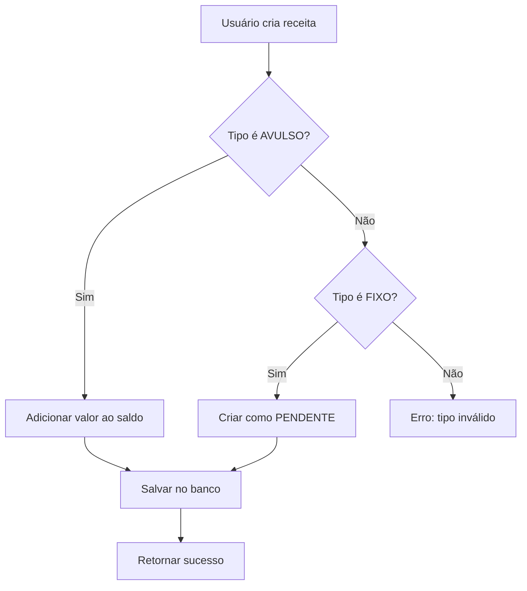

# Arquitetura do Módulo de Receitas

## Visão Geral

Este documento detalha a implementação do módulo de Receitas (Revenue) para o sistema de gestão financeira pessoal. O módulo foi projetado para permitir o registro e controle de receitas mensais, seguindo os mesmos padrões de qualidade já estabelecidos no módulo de Despesas.

## Requisitos Funcionais

### 1. Cadastro de Receitas

- Registro de receitas com nome, valor, categoria e data
- Dois tipos de receita: **AVULSO** (entrada única) e **FIXO** (recorrente mensal)
- Associação com categorias (reutilizando o sistema existente de Categories)

### 2. Integração com Saldo

- Receitas do tipo AVULSO são automaticamente adicionadas ao saldo do usuário (monthlySalary)
- Receitas do tipo FIXO ficam como "PENDENTE" até serem recebidas, quando então atualizam o saldo

### 3. Listagem e Gestão

- Lista de todas as receitas cadastradas
- Edição e exclusão de receitas
- Visualização por mês/ano

### 4. Integração com Dashboard

- Cards no dashboard mostrando:
  - Total de Receitas do mês
  - Receitas Fixas (previsão mensal)
  - Receitas Avulsas recebidas

---

## Estrutura de Dados

### Banco de Dados

#### Tabela: revenues

| Coluna              | Tipo          | Descrição                               |
| ------------------- | ------------- | --------------------------------------- |
| reven_id            | BIGINT (PK)   | ID único da receita                     |
| reven_ds_name       | VARCHAR(255)  | Nome/descrição da receita               |
| reven_vl_amount     | DECIMAL(10,2) | Valor total da receita                  |
| reven_st_status     | VARCHAR(20)   | Status: PENDENTE, RECEBIDO              |
| reven_ds_type       | VARCHAR(20)   | Tipo: AVULSO, FIXO                      |
| reven_dt_registered | DATE          | Data de registro                        |
| reven_dt_received   | DATE          | Data de recebimento                     |
| catego_id           | BIGINT (FK)   | ID da categoria                         |
| reven_fl_active     | BOOLEAN       | Se está ativa (para FIXO)               |
| reven_nr_due_day    | INT           | Dia de recebimento esperado (para FIXO) |

### Modelo Backend: Revenue.java

```java
@Entity
@Table(name = "revenues")
public class Revenue {
    @Id
    @GeneratedValue(strategy = GenerationType.IDENTITY)
    private Long id;

    private String name;
    private BigDecimal amount;
    private String status;      // PENDENTE, RECEBIDO
    private String type;        // AVULSO, FIXO
    private LocalDate registeredAt;
    private LocalDate receivedDate;

    @ManyToOne
    @JoinColumn(name = "catego_id")
    private Category category;

    private Boolean active = true;
    private Integer dueDay;
}
```

---

## Backend - API REST

### Endpoints

| Método | Endpoint                           | Descrição                |
| ------ | ---------------------------------- | ------------------------ |
| GET    | /api/revenues                      | Listar todas as receitas |
| GET    | /api/revenues/{id}                 | Buscar receita por ID    |
| POST   | /api/revenues                      | Criar nova receita       |
| PUT    | /api/revenues/{id}                 | Atualizar receita        |
| DELETE | /api/revenues/{id}                 | Excluir receita          |
| GET    | /api/revenues/summary              | Resumo de receitas       |
| GET    | /api/revenues/month/{year}/{month} | Receitas por mês         |
| POST   | /api/revenues/receive/{id}         | Marcar como recebida     |

### DTO: RevenueDTO

```java
public record RevenueDTO(
    String nome,
    String tipo,              // AVULSO ou FIXO
    BigDecimal valor,
    String nomeCategoria,
    Integer diaVencimento,   // Para FIXO
    Boolean ativa,
    LocalDate dataRecebimento
) {}
```

### Service: RevenueService

O serviço gerencia:

1. **Registro de receita avulsa**: Adiciona valor diretamente ao saldo do usuário
2. **Registro de receita fixa**: Cria como PENDENTE, aguarda recebimento
3. **Recebimento de receita fixa**: Ao marcar como recebida, adiciona ao saldo
4. **Exclusão**: Remove do saldo se já была recebida

---

## Frontend - Estrutura de Arquivos

### Arquivos a Criar

```
gestao-pessoal/src/
├── services/
│   └── revenueService.js      # API calls para receitas
├── pages/
│   ├── RevenueList.jsx        # Lista de receitas
│   └── RevenueForm.jsx        # Formulário criar/editar
└── components/
    └── ui/
        └── (reutiliza componentes existentes)
```

### Fluxo de Navegação

```
Sidebar
├── Dashboard
├── Despesas
├── Parcelas
├── Categorias
└── Receitas (NOVO)
```

### Dashboard - Cards de Receita

O dashboard será atualizado com novos cards:

1. **Total de Receitas**: Soma de todas as receitas do mês atual
2. **Receitas Fixas**: Valor total de receitas fixas cadastradas
3. **Receitas Avulsas**: Receitas não-recorrentes recebidas

### Integração com Saldo

O cálculo de saldo no dashboard será atualizado:

```
Saldo Atual = monthlySalary (do User)
            + Total Receitas Recebidas
            - Total Despesas Pagas
```

---

## Diferenças entre Receitas e Despesas

| Aspecto         | Despesas                                 | Receitas                           |
| --------------- | ---------------------------------------- | ---------------------------------- |
| Tipo            | AVULSO, PARCELADO, FIXO                  | AVULSO, FIXO                       |
| Status Inicial  | PAGO (AVULSO), PENDENTE (PARCELADO/FIXO) | RECEBIDO (AVULSO), PENDENTE (FIXO) |
| Efeito no Saldo | Subtrai                                  | Soma                               |
| Parcelamento    | Sim (PARCELADO)                          | Não                                |

---

## Plano de Implementação

### Fase 1: Backend

- [ ] 1.1 Criar Entity Revenue
- [ ] 1.2 Criar Repository RevenueRepository
- [ ] 1.3 Criar DTO RevenueDTO
- [ ] 1.4 Criar Service RevenueService
- [ ] 1.5 Criar Controller RevenueController

### Fase 2: Frontend - Estrutura Base

- [ ] 2.1 Criar revenueService.js
- [ ] 2.2 Adicionar rotas em App.jsx
- [ ] 2.3 Adicionar item na Sidebar

### Fase 3: Frontend - Páginas

- [ ] 3.1 Criar RevenueList.jsx (lista de receitas)
- [ ] 3.2 Criar RevenueForm.jsx (formulário)

### Fase 4: Integração Dashboard

- [ ] 4.1 Atualizar Dashboard com cards de receita
- [ ] 4.2 Integrar summary de receitas
- [ ] 4.3 Atualizar cálculo de saldo

### Fase 5: Testes

- [ ] 5.1 Testar CRUD de receitas
- [ ] 5.2 Testar integração com saldo
- [ ] 5.3 Testar visualização no dashboard

---

## Considerações Técnicas

### Reutilização de Componentes

- O frontend reutiliza os componentes UI existentes (Card, Button, Modal, Input)
- O backend reutiliza a entity Category para分类

### Validações

- Nome obrigatório
- Valor deve ser positivo
- Categoria obrigatória
- Para FIXO, dia de vencimento é opcional (1-31)

### Casos de Uso

1. **Usuário recebe Salary extra**
   - Cria receita AVULSO → Valor é adicionado ao saldo

2. **Usuário cadastra salário mensal como FIXO**
   - Cria receita FIXO → Fica como PENDENTE
   - Quando recebe, marca como RECEBIDO → Valor é adicionado ao saldo

3. **Usuário quer ver receitas do mês**
   - Acessa /revenues → Vê lista filtrada por mês atual

---

## Diagramas

### Fluxo de Criação de Receita



### Estrutura de Arquivos Após Implementação

```
src/main/java/com/example/
├── models/
│   ├── Expenses.java
│   ├── Revenue.java        [NOVO]
│   └── Category.java
├── Dto/
│   ├── ExpensesDTO.java
│   └── RevenueDTO.java     [NOVO]
├── repository/
│   ├── ExpensesRepository.java
│   └── RevenueRepository.java [NOVO]
├── service/
│   ├── ExpensesService.java
│   └── RevenueService.java    [NOVO]
└── Controller/
    ├── ExpensesController.java
    └── RevenueController.java [NOVO]

gestao-pessoal/src/
├── services/
│   ├── expenseService.js
│   └── revenueService.js   [NOVO]
├── pages/
│   ├── ExpensesList.jsx
│   ├── ExpenseForm.jsx
│   ├── RevenueList.jsx     [NOVO]
│   └── RevenueForm.jsx     [NOVO]
└── App.jsx                 [ATUALIZAR]
```

---

## Conclusão

Este módulo de Receitas foi projetado para:

1. **Simplicidade**: Interface similar às Despesas para curva de aprendizado rápida
2. **Consistência**: Segue os mesmos padrões técnicos do código existente
3. **Funcionalidade**: Integração direta com o sistema de saldo do usuário
4. **Escalabilidade**: Estrutura pronta para futuras expansões (relatórios, gráficos)

A implementação seguirá a ordem das fases descritas neste documento, garantindo uma entrega incremental e testável.
